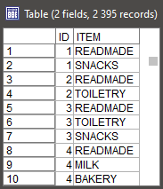
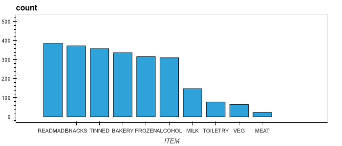
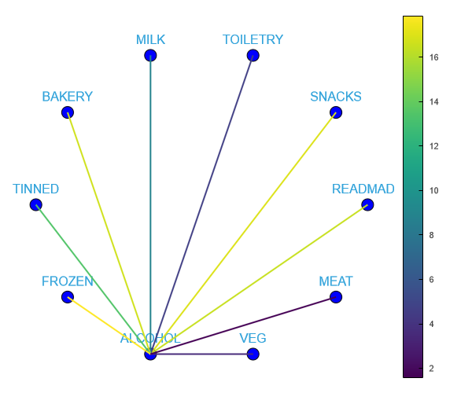
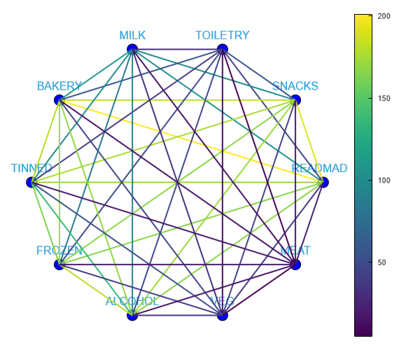
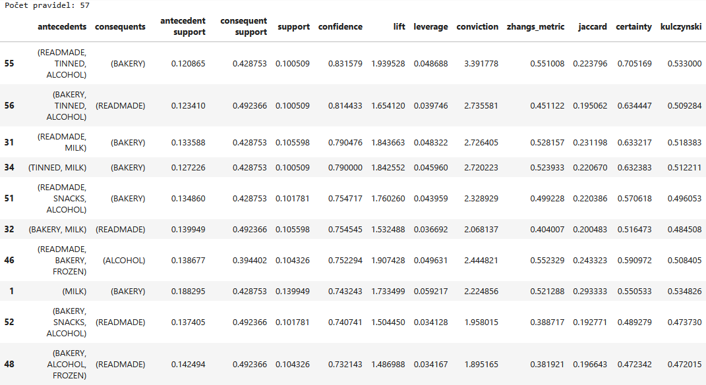

# Analýza nákupního košíku

## Porozumění problému

Obchodní řetězec potřebuje analyzovat nakupovací návyky svých zákazníků, aby mohl provádět cílené nabídky určitého typu zboží. Úloha má dva cíle: vytvořit akci na prodej konkrétního zboží (nabídnout či nenabídnout – v našem případě se jedná o zboží typu alkohol) a vytvořit obecné doporučení, jaké zboží zákazníkovi ještě nabídnout.

Soubor `Shopping_items.sav` představuje transakční data vznikající při průchodu zákazníka pokladnou. Datová matice obsahuje proměnné `ID` a `ITEM`. `ID` je identifikátor jednoho konkrétního nákupu a `ITEM` je druh zboží, který byl součástí tohoto nákupu. Vstupní data jsou zjednodušena tím, že zboží je již zařazeno do produktových skupin.



## První spuštění projektu

V kořenovém adresáři projektu otevřete PowerShell a spusťte následující příkazy:

```ps1
# 1. Vytvoření virtuálního prostředí
py -m venv .venv

# 2. Aktivace virtuálního prostředí
.venv\Scripts\activate

# 3. Nainstalování potřebných závislostí
py -m pip install -r requirements.txt

# 4. Spuštění aplikace Jupyter Notebook v adresáři s notebookem
jupyter notebook --notebook-dir=./notebook
```

Po načtení uživatelského rozhraní aplikace Jupyter Notebook klikněte na soubor _alza.ipynb_.

Práce ve virtuálním prostředí je alespoň na mém PC poněkud pomalejší (pomalejší instalace balíků, pomalé načítání grafů, ...). Pokud vám nevadí globální instalace balíků, pak stačí dvojice příkazů `pip install -r requirements.txt` a `jupyter notebook --notebook-dir=./notebook`.

## Import závislostí

Pro realizaci zadání je použita knihovna _pandas_. Do její datové struktury zvané _DataFrame_ načteme data ze vstupního souboru `Shopping_items.sav` (balíkem _pyreadstat_) a budeme na ní provádět operace jako na datové matici v Modeleru.

Pro vizualizaci dat je použita kombinace _hvplot_ + _bokeh_. Jedním z vykreslovaných grafů je tzv. pavučinový diagram (_Graphs → Web_ v Modeleru, omluvte mnou občas používaný kratší výraz „pavučiňák“), který ale žádná mnou zkoumaná knihovna nativně nepodporuje. Pro jeho vlastní implementaci je proto použita knihovna _networkx_.

Modelovací algoritmus Apriori je obsažen v balíku _mlxtend_.

```py
import itertools  # Vytvoření kombinací, pomůže při tvorbě pavučiňáku
import pathlib    # K souboru .sav se dostaneme relativní cestou

import hvplot.networkx as hvnx  # Pavučiňák
import networkx as nx           # Pavučiňák
import pandas as pd             # Práce s datovou maticí – datová analýza v Pythonu
import pyreadstat               # Čtení .sav souboru
from mlxtend.frequent_patterns import apriori, association_rules

pd.options.plotting.backend = "hvplot"  # Namísto matplotlib používáme hvplot + bokeh
```

## Porozumění datům

Transakční data je nejrpve nutné načíst, k tomu použijeme balík _pyreadstat_. Než se vrhneme na samotnou datovou matici v podobě _pandas DataFrame_, můžeme vyčíst z metadat, že máme na vstupu 2395 řádků a dva sloupce: `ID` a `ITEM`.

```py
# == Nalezení a načtení SPSS dat. Dostáváme pandas DataFrame a metadata. ==
PATH = pathlib.Path()
PATH_SHOPPING_ITEMS = PATH / ".." / "data" / "Shopping_items.sav"
df, meta = pyreadstat.read_sav(PATH_SHOPPING_ITEMS)
print(type(df))
# <class 'pandas.core.frame.DataFrame'>
print(type(meta))
# <class 'pyreadstat._readstat_parser.metadata_container'>

# == Užitečná metadata ==
print("Počet řádků:\t", meta.number_rows)
# Počet řádků:   2395
print("Počet sloupců:\t", meta.number_columns, "... konkrétně:", meta.column_names)
# Počet sloupců:    2 ... konkrétně: ['ID', 'ITEM']
```

Z _DataFrame_ si lze pomocí `df.head(𝑛)` nechat vypsat prvních 𝑛 řádků datové matice, výpis `df.head(10)` je totožný s náhledem v Modeleru (viz první obrázek). Dále nás zajímá, jakých všech hodnot může nabývat sloupec `ITEM`, tedy jaké kategorie zboží (produktové skupiny) se v&nbsp;datech vyskytují. Tato informace se bude hodit i později při tvorbě pavučiňáku, proto si ji uložíme do proměnné `ITEM_TYPES`.

```py
ITEM_TYPES = df["ITEM"].unique()
ITEM_TYPES
# array(['READMADE', 'SNACKS', 'TOILETRY', 'MILK', 'BAKERY', 'TINNED',
#        'FROZEN', 'ALCOHOL', 'VEG', 'MEAT'], dtype=object)
```

### Co se jak moc nakupuje?

Pandas umožňují snadno vizualizovat četnost jednotlivých typů zboží v libovolném nákupním košíku.

```py
df["ITEM"].value_counts().plot(kind="bar")
```



Můžeme vidět, že nejpopulárnější kategorií je `READMADE`. Těsně za `READMADE` se drží ostatní kategorie kromě čtveřice `MILK`, `TOILETRY`, `VEG` a `MEAT`; která je viditelně méně populární. Je dobré připomenout, že prozatím se zabýváme celkovým počtem prodaných kusů a nebereme v&nbsp;potaz kombinace zboží v&nbsp;jednotlivých košících.

Díky knihovně _bokeh_ lze v prostředí Jupyter Notebook najet kurzorem myši na jednotlivé sloupce grafu a nechat si tak zobrazit přesnou hodnotu daného sloupce. Pro procentuální vyjádření popularity si lze upravit textový výstup funkce `value_counts`.

```py
# `normalize=True` převede na rozsah 0–1, pak vynásobit stem, zaokrouhlit a přidat " %"
df["ITEM"].value_counts(normalize=True).mul(100).round(2).astype(str) + " %"
# READMADE    16.16 %
# SNACKS      15.57 %
# TINNED      14.95 %
# BAKERY      14.07 %
# FROZEN      13.19 %
# ALCOHOL     12.94 %
# MILK         6.18 %
# TOILETRY     3.26 %
# VEG          2.71 %
# MEAT         0.96 %
```

## Příprava dat

### Restrukturalizace dat na příznaky

Pro algoritmy tvořící asociační pravidla potřebujeme transakční data převést na tzv. tabulková data, kde každý řádek reprezentuje jeden nákupní košík. Jednotlivé sloupce jsou pojmenované podle kategorií zboží a obsahují dichotomické proměnné, které vyjadřují, zdali se daná položka v&nbsp;daném košíku vyskytuje či nikoliv.

```py
# == Obdoba uzlu SetToFlag v SPSS Modeler ==
# get_dummies převádí kategoriální data na příznaková
# parametry: chceme převést DataFrame df, v něm sloupec "ITEM", u vzniklých sloupců nepřidávat žádný prefix
# seskupujeme podle sloupce "ID" (jeden nákup), po groupby musí přijít agregační funkce – suma nám udělá jedničky a nuly
flags = pd.get_dummies(df, columns=["ITEM"], prefix="", prefix_sep="").groupby(["ID"]).sum()
flags
```

ID|ALCOHOL|BAKERY|FROZEN|MEAT|MILK|READMADE|SNACKS|TINNED|TOILETRY|VEG
---|---|---|---|---|---|---|---|---|---|---
1.0|0|0|0|0|0|1|1|0|0|0
2.0|0|0|0|0|0|1|0|0|1|0
3.0|0|0|0|0|0|1|1|0|1|0
4.0|0|1|0|0|1|1|0|0|0|0
5.0|0|0|0|0|0|1|0|0|0|0
...|...|...|...|...|...|...|...|...|...|...

Pro splnění prvního zadání se nám bude hodit množina všech nákupních košů, které obsahují alkohol, a proto si ji uložíme do proměnné `flags_alcohol`.

```py
flags_alcohol = flags[flags["ALCOHOL"] == 1]
```

### Pavučinový diagram

Pro vykreslení tabulkových dat, které vyjadřují společné typy zboží v rámci nákupního košíku, je možné použít pavučinový diagram. Jelikož jsem nenašel žádnou knihovnu, která by tento typ grafu nativně podporovala, tak ho vykresluji „ručně“. Jedná se o obecný graf z balíku _networkx_, kde definuji uzly (jejich souřadnice a popisky) a hrany (mezi kterými uzly vedou? jaké mají ohodnocení?). Pro eliminaci opakujícího se kódu byla definována podpůrná funkce.

```py
def web(nodes, edges, edge_colors):
    graph = nx.Graph()

    # = Uzly grafu =
    # Pro každý node přidáme jeden uzel do grafu a rozmístíme je na pomyslné kružnici (circular layout)
    graph.add_nodes_from(nodes)
    nodes_positions = nx.layout.circular_layout(graph)
    result_nodes = hvnx.draw_networkx_nodes(graph, nodes_positions, node_color="blue")

    # = Popisky uzlů =
    # Dokumentace zmiňuje nastavení fontu u popisků, bohužel tyto parametry nic nedělají (alespoň na mé straně)
    # Proto jsou kvůli čitelnosti popisky alespoň posunuty (v defaultu se nachází přímo na pozici uzlu, překrývá se)
    # (O kolik posunout)
    LABEL_OFFSET = 0.1
    # (Stejné souřadnice jako uzly, jen je druhá složka posunuta o LABEL_OFFSET)
    label_posistions = {k: [v[0], v[1] + LABEL_OFFSET] for k, v in nodes_positions.items()}
    result_labels = hvnx.draw_networkx_labels(graph, label_posistions)

    # = Hrany a jejich barvy =
    graph.add_edges_from(edges)
    result_edges = hvnx.draw_networkx_edges(graph, nodes_positions, edge_color=edge_colors, colorbar=True)

    return result_nodes, result_labels, result_edges
```

* Podpůrná funkce má parametry:
  * Uzly `nodes` – kolekce řetězců
    * V našem případě vždy dosadíme `ITEM_TYPES`, v grafu chceme mít všechny kategorie zboží.
  * Hrany `edges` – kolekce dvojic řetězců z `nodes`
  * Ohodnocení `edge_colors` – kolekce čísel, kde každé číslo z `edge_colors[𝑖]` odpovídá hraně z `edges[𝑖]`.
    * Hodnota těchto čísel určuje obarvení dané hrany (analogie k tloušťce čáry v Modeleru).
* Podpůrná funkce vrací trojici (uzly, popisky, hrany) pro vykreslení.

#### Pavučinový diagram – Alkohol

Protože máme datovou matici tvořenou jedničkami a nulami, můžeme sečíst všechny její řádky do jednoho a zjistit tak, jaké typy zboží se kolikrát nacházely v košíku společně s alkoholem. (Momentálně pracujeme s `flags_alcohol`, řešíme tedy pouze košíky obsahující alkohol.)

```py
flags_alcohol_sum = flags_alcohol.sum()
flags_alcohol_sum
# ALCOHOL     310
# BAKERY      169
# FROZEN      181
# MEAT         16
# MILK         90
# READMADE    167
# SNACKS      172
# TINNED      136
# TOILETRY     47
# VEG          36

n_alcohol_connections = flags_alcohol_sum.sum() - flags_alcohol_sum["ALCOHOL"]
n_alcohol_connections
# 1014
```

Nákupů obsahujících alkohol je 310, to odečteme od celkového počtu všech nakoupených položek a dostáváme 1014. Jedná se o počet položek, které se v libovolném košíku vyskytly společně s alkoholem. Tímto číslem budeme dělit, abychom hrany pavučiňáku mohli vyjádřit procentuelně. Pro podpůrnou funkci je třeba popsat hrany a jejich barvy (ohodnocení).

```py
# Vedeme hranu z alkoholu do všeho, co není alkohol.
edges = [(x, "ALCOHOL") for x in ITEM_TYPES if x != "ALCOHOL"]

# Pro každou hranu (𝑥, "ALCOHOL") zjistíme počet položek ze sečtených řádků pro hodnotu 𝑥
# a vydělíme dříve spočteným 1014. (Nakonec vynásobit stovkou pro procenta.)
edge_colors = [flags_alcohol_sum[x[0]] / n_alcohol_connections * 100 for x in edges]

# Podpůrná funkce nám vrátí iformace o uzlech, popiscích a hranách pro vykreslení
nodes, labels, edges = web(ITEM_TYPES, edges, edge_colors)

# Operace násobení zde slouží pro vykreslení všeho najednou (uzly, popisky a hrany grafu)
(nodes * labels * edges).opts(width=600, height=500)
```



Z grafu je dobře vidět, že s alkoholem je nejpopulárnější nakupovat `FROZEN`, `SNACKS`, `BAKERY` a `READMADE`.

#### Pavučinový diagram – Vše

Pro obecný pavučiňák si pomocí _itertools_ vytvoříme všechny možné dvojice kategorií zboží a pro každou z nich spočteme řádky představující košík, který obsahuje obě položky z dvojice. Pomocí konstant `WEB_RANGE_MIN` a `WEB_RANGE_MAX` můžeme omezit rozsah vykreslovaných četností.

```py
# Zobrazovat hrany v tomto rozsahu (obdoba posuvníku v Modeleru)
WEB_RANGE_MIN = 0
WEB_RANGE_MAX = 250

item_pairs_all = list(itertools.combinations(ITEM_TYPES, 2))  # Všechny možné dvojice

# Kolekce hran a jejich ohodnocení:
item_pairs = []  # Sem přidáme jen dvojice, které vyhovují rozsahu WEB_RANGE
item_pairs_quantities = []  # Sem přidáme ohodnocení hran těchto dvojic

for pair in item_pairs_all:
    # `flags[(flags[pair[0]] == 1) & (flags[pair[1]] == 1)]` vrací takové řádky, kde jsou obě položky z dvojice rovny jedné
    # `len(df.index)` je preferovaná metoda pro zjištění počtu řádku v pandas DataFrame
    quantity = len(flags[(flags[pair[0]] == 1) & (flags[pair[1]] == 1)].index)
    if WEB_RANGE_MIN <= quantity <= WEB_RANGE_MAX:
        # Pokud je počet výskytů konkrétní dvojice produktů ve zvoleném rozsahu,
        # přidáme dvojici a kvantitu do item_pairs(_quantities), ze kterých pak vykreslíme pavučiňák.
        item_pairs.append(pair)
        item_pairs_quantities.append(quantity)

# Výpis všech možných dvojic zboží a kolikrát se spolu v košíku vyskytly:
list(zip(item_pairs, item_pairs_quantities))
#[(('READMADE', 'SNACKS'), 192),
# (('READMADE', 'TOILETRY'), 46),
# (('READMADE', 'MILK'), 105),
# (('READMADE', 'BAKERY'), 201),
# (('READMADE', 'TINNED'), 170),
# ...
# (('ALCOHOL', 'MEAT'), 16),
# (('VEG', 'MEAT'), 7)]

# Vykreslit
nodes, labels, edges = web(ITEM_TYPES, item_pairs, item_pairs_quantities)
(nodes * labels * edges).opts(width=600, height=500)
```



## Modelování – Apriori

Pro tvorbu asociačních pravidel je použit balík _mlxtend_.

```py
MINIMUM_ANTECEDENT_SUPPORT = 0.1
MINIMUM_RULE_CONFIDENCE = 0.60

# Použitá metoda preferuje dostat matici s bool proměnnými namísto jedniček a nul, přemapujeme
flags_bool = flags.map(bool)

# Do APRIORI dosadíme datovout matici, minimální support předpokladů, a `use_colnames=True`
# Bez `use_colnames=True` by pravidla obsahovala čísla namísto názvů zboží
item_frequencies = apriori(flags_bool, min_support=MINIMUM_ANTECEDENT_SUPPORT, use_colnames=True)

# Generace asociačních pravidel s minimální confidence
# zahazuji sloupec representativity, protože je všude roven 1.0
# řadím podle confidence
a_rules = (
    association_rules(item_frequencies, metric="confidence", min_threshold=MINIMUM_RULE_CONFIDENCE)
    .drop(columns=["representativity"])
    .sort_values(by="confidence", ascending=False)
)

print("Počet pravidel:", len(a_rules.index))
a_rules
```



Pro první část zadání si do proměnné `a_rules_alcohol` uložíme jen ty pravidla, jejichž závěrem je alkohol.

```py
# Kolekce předpokladů a závěrů jsou typu frozenset; selekce pravidel, kde je závěrem alkohol:
a_rules_alcohol = a_rules[a_rules["consequents"] == frozenset({"ALCOHOL"})]
a_rules_alcohol
```


Nyní tedy máme vygenerovaná pravidla s `MINIMUM_ANTECEDENT_SUPPORT` a `MINIMUM_RULE_CONFIDENCE` pro doporučení alkoholu v akci a pro obecné doporučení dalšího typu zboží. Z těchto pravidel nyní vytvoříme doporučovací Python funkce, které budeme moct evaluovat a nasadit.

### Doporučovací funkce

#### Doporučovací funkce pro alkohol

Pokud je zkoumaný nákup nadmnožinou nějaké množiny předpokladů pravidel, které mají jako závěr alkohol, a zároveň zkoumaný nákup alkohol ještě neobsahuje, pak alkohol nabídneme. Funkce si bere jako parametry obsah košíku (kolekce řetězců) a seznam pravidel ve formě _DataFrame_. Funkce vrací boolean True/False – doporučit/nedoporučit.

```py
def recommend_alcohol(in_cart : list[str], rules : pd.DataFrame) -> bool:
    in_cart_set = set(in_cart)
    if "ALCOHOL" in in_cart_set:
        return False
    for _, row in rules.iterrows():
        # Na množiny lze používat operátory <, >, <=, >= pro kontrolu podmnožin/nadmnožin
        if in_cart_set >= set(row["antecedents"]):
            return True
    return False
```

#### Všeobecná doporučovací funkce

Tato funkce namísto boolean vrací seznam položek, které ke vstupnímu nákupu ještě doporučuje. První dva parametry jsou stejné (obsah košíku a sada pravidel), třetí parametr určuje počet výstupních doporučení.

V této funkci vybereme taková pravidla, pro která platí, že alespoň jeden z předpokladů musí být ve zkoumaném košíku a závěr pravidla nesmí být ve zkoumaném košíku. Pokud jsou pravidla na vstupu seřazená podle confidence, stačí pak z vyhovujících pravidel získat prvních 𝑛 unikátních závěrů a ty vrátit (kde 𝑛 je třetím parametrem, tedy počet doporučení).

```py
def recommend_something(in_cart : list[str], rules : pd.DataFrame, n_recommendations : int) -> list[str]:
    """
    [!] Počítáme s tím, že pravidla už jsou seřazená podle confidence
    """
    recommendations = (rules[
        (rules["antecedents"].apply(lambda antecedents: any(product in antecedents for product in in_cart)))
        &
        (rules["consequents"].apply(lambda consequents: not any(product in consequents for product in in_cart)))
    ])
    result = []
    for _, row in recommendations.iterrows():
        for item in row["consequents"]:
            if item not in result:
                result.append(item)
    return result[:n_recommendations]
```

## Evaluace – doporučení alkoholu

Funkci pro doporučení alkoholu lze evaluovat pomocí matice sousednosti. Pro její tvorbu jsem nevyužil žádné knihovní funkce, ale postupoval jsem metodou „simple stupid“: Podívám se v&nbsp;historii nákupů na všechny sloupce kromě alkoholu a podle pravidel určím, zdali bych alkohol danému zákazníkovi nabídl. Pak se podívám na sloupec s alkoholem, zdali si ho tento zákazník skutečně koupil. Podle toho měřím kvalitu modelu.

```py
n_alcohol_recommended_correctly = 0        # True positive
n_alcohol_recommended_incorrectly = 0      # False positive
n_alcohol_not_recommended_correctly = 0    # True negative
n_alcohol_not_recommended_incorrectly = 0  # False negative

for _, row in flags.iterrows():
    # Row (pandas Series) bez sloupce s alkoholem je převeden na slovník (stejně jako `in_my_cart_dict` v sekci nasazení)
    row_cart = [k for k, v in row.drop(labels=["ALCOHOL"]).to_dict().items() if v == 1]
    # Doporučíme zákazníkovi alkohol?
    recommended_alcohol = recommend_alcohol(row_cart, a_rules_alcohol)
    # Koupil si zákazník skutečně alkohol?
    bought_alcohol = row["ALCOHOL"] == 1
    
    if recommended_alcohol:
        if bought_alcohol:
            n_alcohol_recommended_correctly += 1
        else:
            n_alcohol_recommended_incorrectly += 1
    else:
        if bought_alcohol:
            n_alcohol_not_recommended_incorrectly += 1
        else:
            n_alcohol_not_recommended_correctly += 1

# Matice záměn: sloupce jsou klasifikace, řádky jsou skutečnost
print("Alcohol\t  F\t  T")
print("     F \t", n_alcohol_not_recommended_correctly, "\t", n_alcohol_recommended_incorrectly)
print("     T \t", n_alcohol_not_recommended_incorrectly, "\t", n_alcohol_recommended_correctly)

# Alcohol       F       T
#      F       315     161
#      T       109     201
```

Ze všech 786 nákupů bychom správně 315krát nenabídli a 201krát nabídli alkohol v akci. Co se týče chyb, tak máme 161 „zbytečných nabídek“ a 109 „promarněných příležitostí“.

Z hodnot matice záměn pak lze spočítat další kvantifikátory:

```py
# Zjednodušení názvů
TP, FP, TN, FN = (n_alcohol_recommended_correctly,
                  n_alcohol_recommended_incorrectly,
                  n_alcohol_not_recommended_correctly,
                  n_alcohol_not_recommended_incorrectly)

print("Celkova spravnost =", (TP+TN)/(TP+FP+TN+FN))
print("    Celkova chyba =", (FP+FN)/(TP+FP+TN+FN))
print("         Presnost =", TP/(TP+FP))
print("      Senzitivita =", TP/(TP+FN))
print("     Specificnost =", TN/(TN+FP))
# Celkova spravnost = 0.6564885496183206
#     Celkova chyba = 0.3435114503816794
#          Presnost = 0.5552486187845304
#       Senzitivita = 0.6483870967741936
#      Specificnost = 0.6617647058823529
```

## Nasazení

Nasazení simulujeme vytvořením vlastního nákupního košíku a voláním doporučovacích funkcí.

```py
# == Analogie SPSS User Input ==
CUSTOMER_ID = 258
in_my_cart_dict = {
    'READMADE' : 1,
    'SNACKS'   : 0,
    'TOILETRY' : 0,
    'MILK'     : 0,
    'BAKERY'   : 0,
    'TINNED'   : 0,
    'FROZEN'   : 1,
    'ALCOHOL'  : 0,
    'VEG'      : 0,
    'MEAT'     : 1
}

# Slovník je převeden na list obsahující klíče, kde byla hodnota rovna jedné
in_my_cart = [k for k, v in in_my_cart_dict.items() if v == 1]
in_my_cart
# ['READMADE', 'FROZEN', 'MEAT']

# == Nasazení doporučení alkoholu ==
recommend_result = recommend_alcohol(in_my_cart, a_rules_alcohol)
print(recommend_result, "– Zakaznikovi", CUSTOMER_ID, "nabidni" if recommend_result else "nenabizej", "alkohol v akci.")
# True – Zakaznikovi 258 nabidni alkohol v akci.

# == Nasazení obecného doporučení ==
print("Zakaznikovi", CUSTOMER_ID, "nabidni:\n", recommend_something(in_my_cart, a_rules, 3))
# Zakaznikovi 258 nabidni:
#  ['BAKERY', 'ALCOHOL', 'SNACKS']
```
